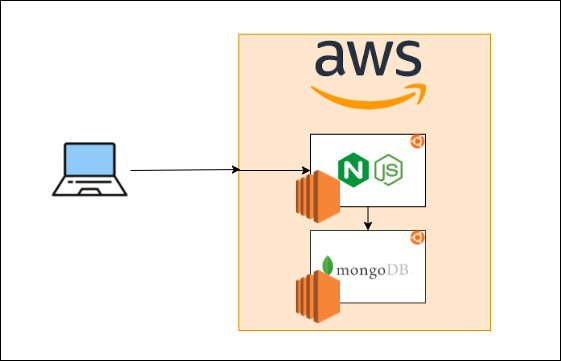

> install `Markdown All in one` extension in VSC
# what is DevOps
## why DevOps
### Benefits of DevOps

**Four pillars of DevOps best practice**
- Ease of Use (human interactions)
- Flexibility (can adapt to product owner's needs)
- Robustness - Faster delivery of product
- Cost - cost effective (Automation - CI/CD)

### Monolith - 2 tier & Microservices Architectures


# Virtual Machines
## **Requirements**
> [Install Ruby](https://github.com/oneclick/rubyinstaller2/releases/download/RubyInstaller-2.6.6-1/rubyinstaller-devkit-2.6.6-1-x64.exe)

> [Install Vagrant](https://www.vagrantup.com/)

> [Install VirtualBox](https://www.virtualbox.org/wiki/Downloads)

## **Vagrant**
### Commands:
- initialize vagrant with Vagrantfile `vagrant init`
- after configuring vagrantfile, deploy the VM `vagrant up`
- check status `vagrant status`
- delete VM `vagrant destroy`
- shutdowns the VM `vagrant halt`
- update VM `vagrant reload`
- access VM through SSH `vagrant ssh`

### [Vagrantfile](Vagrantfile)
```
Vagrant.configure("2") do |config|

 # creating a virtual machine ubuntu 
 config.vm.box = "ubuntu/xenial64"
 # creating a private network with ip
 config.vm.network "private_network", ip: "192.168.10.100"

end
```

#### Multi-VMs (example with VMs "app" and "db")
```
Vagrant.configure("2") do |config|
  config.vm.define "app" do |app|
    app.vm.box = "ubuntu/xenial64"
  
    # creating a private network with ip
    app.vm.network "private_network", ip: "192.168.10.100"
  
    # uploads and execute provision.sh relative to Vagrantfile
    app.vm.provision "shell", path: "sync/provision.sh"  

    # optional if file syncing is needed
    app.vm.synced_folder "sync/", "/home/vagrant/app"
  end
  config.vm.define "db" do |db|
    db.vm.box = "ubuntu/xenial64"
    db.vm.network "private_network", ip: "192.168.10.150"
  end
end
```

#### **Additional configuration options**
- execute script upon VM creation `config.vm.provision "shell", path: "{file-path-relative-to-Vagrantfile}"`
- mounting a host folder to VM `config.vm.synced_folder "{host-path}", "{VM-path}"`

## **Linux**
In Ubuntu we have the `apt` Package Manager formerly known as `apt-get`.
### Linux basics:
- super user do `sudo`
- update package repository `sudo apt update`
- upgrade packages `sudo apt upgrade`
- install a package through apt `sudo apt install`
- remove VM `sudo apt remove`
- manage services `systemctl status¦restart¦start¦stop`
- Who am I `uname -a`
- Where am I `pwd`
- list dir/files `ls`
- list all including hidden folder/files `ls -a`
- make dir `mkdir {dir-name} {dir-name2} ...`
- navigate to dir `cd {dir-name}`
- how to create a file `touch {file-name}` (nano would also create a file if it doesn't already exist)
- How to display content of the file `cat {file-name}`
- How to remove file `rm [-f] {file-name}`
- How to remove directory `rm -r[f] {dir-name}`
- How to copy file `cp {source-file} {destination-file(dir)}`
- How to move file `mv {source-file} {destination-file(dir)}`
- How to check processes `top` or `htop` which is better.
  
#### Permissions
- Read Write Executable Read-Only
- How to check permissions `ls -la` or `ll`
- change permission `[sudo] chmod {permissions} {file-name}` need sudo depending if it needs superuser permissions
  
### [Bash scripting](sync/provision/app.sh)
- `#!/bin/bash` on first line for a bash script file
- `[sudo] ./{script}` to run the script, need sudo depending if it needs superuser permissions

### Linux Variables
- Create Linux Var `FIRST_NAME=SHADMAN`
- How to check the var `echo ${key}`
  
### Environment Variables
- How to check `env var`
- command: `printenv {key}` or `env`
- Create env var `export {key}={value}`
- How to make env var persistent?
- How to delete `env var`, `unset {key}`


- DB PREREQUISITE
```
  // connect to database
if(process.env.DB_HOST) {
  mongoose.connect(process.env.DB_HOST);

  app.get("/posts" , function(req,res){
      Post.find({} , function(err, posts){
        if(err) return res.send(err);
        res.render("posts/index" , {posts:posts});
      })
  });
}
```
  
### Ruby
- `gem install bundler` installing bundler with ruby
- `bundle` installs ruby dependencies
- `rake spec` check for dependencies failures in VM

### **VM**

### Dependencies for app hosted with nginx
- `sudo apt install python-software-properties`
- `curl -sL https://deb.nodesource.com/setup_6.x | sudo -E bash -`
- `sudo apt-get install -y nodejs`
- `sudo npm install pm2 -g`

### App
inside the app folder
- `npm install`
- `npm start`
- `npm install forever -g && forever start app.js` to `npm start` as a daemon

### Nginx Reverse Proxy
To do a simple reverse proxy for our app listening at port 3000, change "location" config /etc/nginx/sites-available/default
```
location / {
                proxy_pass http://localhost:3000;
                proxy_http_version 1.1;
                proxy_set_header Upgrade $http_upgrade;
                proxy_set_header Connection 'upgrade';
                proxy_set_header Host $host;
                proxy_cache_bypass $http_upgrade;
    }
```
### MongoDB
**Install MongoDB 3.2.20**
- `sudo apt-key adv --keyserver hkp://keyserver.ubuntu.com:80 --recv D68FA50FEA312927`
- `echo "deb https://repo.mongodb.org/apt/ubuntu xenial/mongodb-org/3.2 multiverse" | sudo tee /etc/apt/sources.list.d/mongodb-org-3.2.list`
- Don't forget to `sudo apt update -y`
- `sudo apt-get install -y mongodb-org=3.2.20 mongodb-org-server=3.2.20 mongodb-org-shell=3.2.20 mongodb-org-mongos=3.2.20 mongodb-org-tools=3.2.20`
  
#### Allow MongoDB to be accessed from anywhere
change `bindIp: 127.0.0.1` to `bindIp: 0.0.0.0`, and then restart MongoDB `sudo systemctl restart mongod`


## AWS

They are provide:
- Infrastructure as a service (IaaS)
- platform as a service (PaaS)
- software as a service (SaaS)

### EC2 (Elastic Compute Cloud)
> We are allowed to use the Ireland availability zones

#### Create basic EC2 VMs
- Choose OS and CPU Architecture (Ubuntu Server 18.04[x86])
- Choose Instance Type (Default t2.micro)
- Configure Instance Details (Subnet needs to be "DevOpsStudent default 1a" and set "Auto-assign Public IP" to Enable)
- Add Tags (**Key:** NAME, **Value:** ENG103A_SHADMAN)
- Create Security Group "eng103a_shadman", and set SSH sources allowed to "My IP"

> After adding the ssh key in .ssh folder, we can ssh into the machine by `ssh -i "~/.ssh/eng103a.pem" ubuntu@ec2-18-203-110-16.eu-west-1.compute.amazonaws.com`

> we can copy our files onto the cloud by doing `scp -i "~/.ssh/eng103a.pem" -r sync ubuntu@ec2-18-203-110-16.eu-west-1.compute.amazonaws.com:~` (Makes sure to copy the app folder that has all the dependencies already installed)

> We can open more ports for our VMs by selecting or VM and adding them in Security > Security groups > Inbound rules

### **Don't forget to shutdown your AWS VMs after you are done**

- Ceate another EC2 for MongoDB
- set-up/install the required version of MongoDB
- change mongod.conf to allow app access
- Only allow the App instance to access the DB instance
- 27017 APP IP
- Create enviroment variable in the App instance so it can connect to the DB instance
- `npm start`